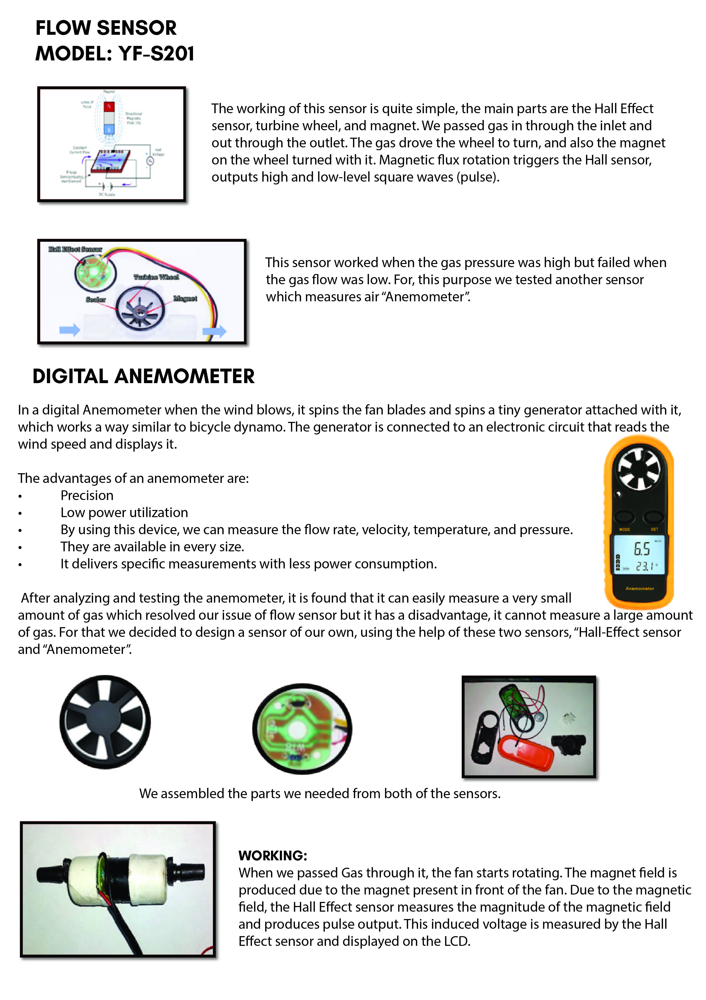
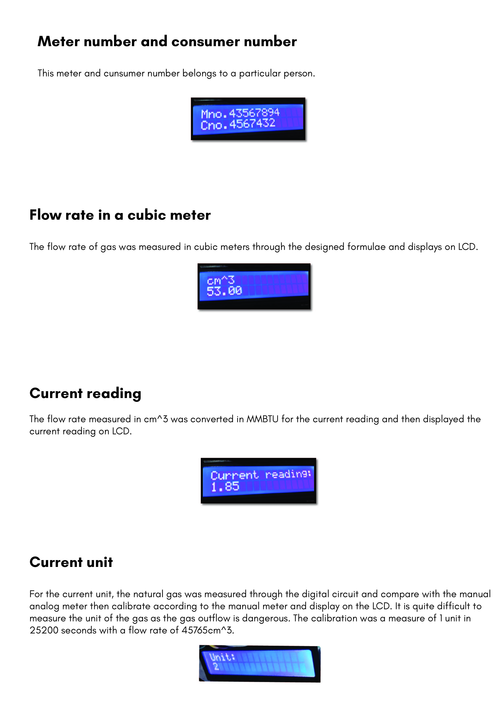
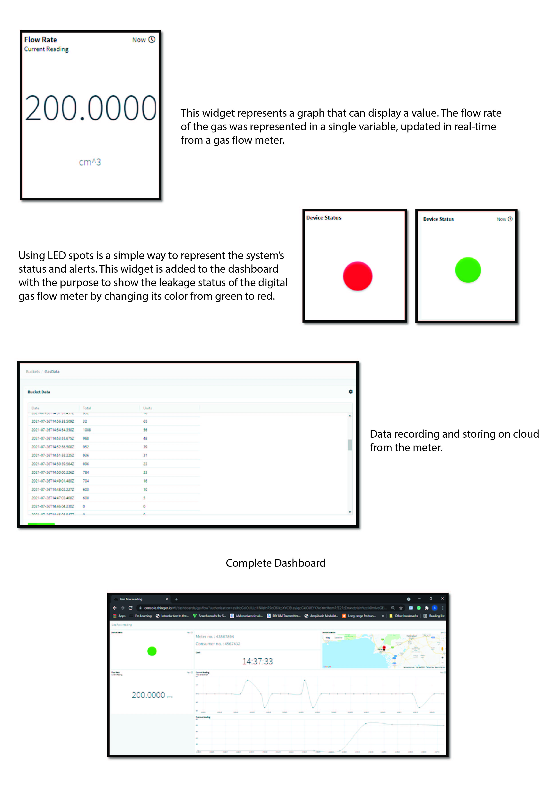

# IoT-Based Digital Gas Flow Meter

This project demonstrates the design and development of a **smart gas flow meter** that measures and monitors real-time gas usage using a custom-built sensor and transmits the data to an IoT platform for live tracking. Designed using Arduino and NodeMCU, it integrates both hardware and software elements to offer a low-cost, scalable solution for gas flow measurement.

---

## 📌 Features

- Custom hybrid gas sensor (Rotor + Hall Effect + Anemometer)
- Real-time gas flow measurement and display on 16x2 LCD
- Conversion of gas flow from cm³ to MMBTU
- Interfacing with Arduino Uno/Nano and NodeMCU (ESP8266)
- Live data transmission to **Thinger.io**
- Cloud dashboard with widgets and data logging
- Compact hardware footprint, designed for low-cost deployment

---

## 🛠️ Hardware Used

- Arduino Uno / Nano  #	Microcontrollers for sensor and display interfacing
- NodeMCU ESP8266  # Wi-Fi enabled controller for IoT connectivity
- Hall Effect Sensor (YF-S201)  #	Rotor-based sensor with Hall Effect transducer
- Digital Anemometer # Fan-based wind/gas flow sensor
- 16x2 LCD Display  # Character display module for parameter output

---

## 🧰 Software Tools

- Arduino IDE  
- EasyEDA (for circuit design)  
- Thinger.io (IoT cloud dashboard)  

---

## 🧠 System Architecture

1. 🔧 Custom Sensor Assembly (Research Innovation)
   Due to COVID-19 supply chain disruptions, we were unable to source a commercial gas flow sensor from international suppliers. As a result, we engineered a custom hybrid flow sensor by combining:
   The rotor mechanism of a digital anemometer (used for wind flow detection), and
   The Hall Effect sensor from a YF-S201 flow meter (to detect rotational pulses)

   This assembly involved:
   Aligning the rotor to create a consistent rotational response to gas flow
   Precisely positioning the Hall sensor to detect pulses without mechanical jitter
   Rigorous manual calibration using water and air pressure sources to approximate natural gas behavior
   Building multiple iterations of the rotor-sensor interface to reduce error and friction
   This solution was innovative and cost-effective, showing a research-driven mindset under real-world constraints — and demonstrates adaptability under pandemic conditions.

   🧪 Signal Processing
      The Hall Effect sensor detects magnetic pulses from the rotor, which are interpreted by an Arduino to calculate gas flow rate. These values are:
     - Displayed locally on an LCD
     - Converted to MMBTU units using an empirical formula
     - Transmitted via NodeMCU (ESP8266) to the cloud for logging and visualization

2. **Signal Processing**: Arduino counts sensor pulses and calculates flow rate.
3. **Display Unit**: LCD shows real-time gas flow, meter reading, and calculated MMBTU.
4. **IoT Communication**: NodeMCU sends live data to Thinger.io using Wi-Fi.
5. **Dashboard**: Flow data is visualized on a real-time IoT dashboard.

---

## 🔣 Key Formula Used

MMBTU = (cm³ / 28.17385) * (984.25 / 1000)
Conversion is based on standard gas consumption metrics (referenced from SSGC guidelines).

## 🌐 IoT Dashboard (Thinger.io)

Real-time widgets: Meter Reading, Flow Rate, Status LED
Custom HTML fields: Consumer Number, Meter ID
Data buckets: For logging historical gas flow values
Secure device communication using Thinger device ID, username, and token

## 🖼️ Images & Diagrams

## 📁 Project Structure

iot-gas-flow-meter/
code/

 ── gas_meter_arduino.ino

  - gas_meter_nodemcu.ino
    
documentation/

 ── system_diagram.pdf
 
images/

 ── *.jpg
 
 PCB/
 
 ── easyeda_files.json
 
README.md
 
LICENSE

##🚀 Future Improvements
- Mobile app notifications (SMS/Email Push alerts)
- Integration with cloud storage (Firebase/AWS)
- Remote shutoff valve using IoT controls
- Battery-powered version for field deployment

## 👤 Author
Abeer Azmat, Sidra & Aqsa Sarfaraz
“This project was developed as part of my undergraduate capstone, focusing on affordable and scalable IoT solutions in energy systems.”

## 📜 License
This project is for educational and demonstration purposes only. Code snippets or design content may not be used commercially without permission.
